# HTTP/1.1 Static File Server in C++
### Event‑driven architecture with epoll, zero‑copy sendfile, and persistent Keep‑Alive connections

A high‑performance HTTP/1.1 static file server built from scratch in C++ using Linux sockets. The server uses an event‑driven, non‑blocking I/O architecture with `epoll` to handle concurrent connections efficiently, `sendfile()` for zero‑copy file transfers, and persistent Keep‑Alive connections to eliminate TCP handshake overhead.

---

## Project Structure

```
cpp-http-server/
├── server.cpp              # Main server code (epoll, sendfile, keep‑alive)
├── index.html              # Test HTML page (with CSS/JS links)
├── style.css                # Test CSS file
├── script.js                # Test JavaScript file
├── sample.txt               # Test plain text file
├── largefile.bin            # Optional 50MB file for benchmarking
├── Makefile                 # Build automation
├── README.md                # This file
└── screenshots/
    ├── server_startup.png       # Server running
    ├── browser_html.png         # HTML with CSS styling
    ├── browser_css.png          # CSS MIME type
    ├── curl_head.png            # HEAD method
    ├── curl_404.png             # 404 Not Found
    ├── curl_405.png             # 405 Method Not Allowed
    ├── curl_keepalive.png       # Keep‑Alive proof (curl side)
    ├── logging.png              # Timestamped request logs
    ├── wrk_low.png              # Benchmark: 21,124 req/sec
    ├── wrk_high.png             # Benchmark: 19,279 req/sec
    ├── wrk_largefile.png        # Large file transfer (sendfile)
    └── stress_test.png          # 10,000 sequential requests
```

---

## Quick Start

This project was developed and tested on **Ubuntu under WSL2**.  
It will work on any system with **G++ and a POSIX‑compatible environment** (Linux, WSL2, etc.).

```bash
# Clone and build
git clone https://github.com/pdsnjvrdy/cpp-http-server.git
cd cpp-http-server

# Compile with optimization
g++ -O2 -o server server.cpp

# Run the server
./server
```

Server listens on `http://localhost:8080`

---

## How It Works

### 1. Event‑Driven Architecture with `epoll`

The server uses a single‑threaded event loop with `epoll` to monitor hundreds of client sockets simultaneously. All sockets are set to **non‑blocking mode**, so the server never blocks on `accept`, `recv`, or `send`. This eliminates the overhead of thread creation and context switching.

```c
// Main event loop
int epoll_fd = epoll_create1(0);
while (1) {
    int num_events = epoll_wait(epoll_fd, events, MAX_EVENTS, TIMEOUT_SEC * 1000);
    for (int i = 0; i < num_events; i++) {
        if (fd == server_fd) {
            // Accept new client
            client_fd = accept(server_fd, ...);
            ev.data.ptr = state;
            epoll_ctl(epoll_fd, EPOLL_CTL_ADD, client_fd, &ev);
        } else {
            // Handle client request
            recv(client_fd, buffer, sizeof(buffer), 0);
            handle_request(state, buffer);
        }
    }
}
```

---

### 2. Zero‑Copy File Transfer with `sendfile()`

The server uses the `sendfile()` system call to transfer files directly from the kernel's disk cache to the network socket, **without copying data into user space**. This eliminates redundant memory copies and significantly improves throughput, especially for large files.

```c
// sendfile(): kernel → socket directly
off_t offset = 0;
sendfile(client_fd, file_fd, &offset, file_size);
```

---

### 3. Persistent Keep‑Alive Connections

The server honours the `Connection: keep-alive` header. Instead of closing the socket after each response, it keeps the connection open and waits for the next request on the same socket. This reduces TCP handshake overhead (`SYN`, `SYN‑ACK`, `ACK`) for multiple requests from the same client.

```c
if (strstr(buffer, "Connection: keep-alive") != NULL) {
    state->keep_alive = 1;
}
// ...
if (state->keep_alive) {
    printf("Client %d kept alive\n", client_fd);
} else {
    close(client_fd);
}
```

---

### 4. TCP Optimizations

- **TCP_NODELAY** – disables Nagle's algorithm, ensuring small packets are sent immediately for low latency.
- **256KB socket buffers** – increases `SO_RCVBUF` and `SO_SNDBUF` for better throughput on large transfers.

---

### 5. HTTP Request Handling

The server implements:
- `GET` and `HEAD` methods.
- MIME type detection (HTML, CSS, JS, PNG, JPEG, TXT, etc.).
- 200 OK, 404 Not Found, and 405 Method Not Allowed responses.
- Query string stripping (e.g., `index.html?foo=bar` → `index.html`).
- Structured request logging with timestamps.

```
// Log format
[Fri Jul 10 08:42:52 2026] GET /index.html
[Fri Jul 10 08:42:52 2026] GET /style.css
```

---

## Performance

Benchmarks were executed on **Ubuntu 22.04 under WSL2** using localhost requests; exact results will vary by hardware.

| Test | Concurrency | Requests/sec | Avg Latency | Transfer Rate |
| :--- | :--- | :--- | :--- | :--- |
| **Small HTML file** | 10 connections | **21,124** | 425µs | 7.11 MB/s |
| **Small HTML file** | 100 connections | **19,279** | 5.15ms | 6.49 MB/s |
| **Large file (50MB)** | 10 connections | N/A | 59ms | **sendfile** |

**Stability:** 10,000 sequential requests completed without crashes or errors.

> **Large file test:** Demonstrates zero-copy `sendfile()` behavior. The kernel transfers the file directly from the disk cache to the socket without user-space copying.

---

## Proof – Screenshots

These results were produced on **Ubuntu 22.04 under WSL2**. They can be reproduced on any machine with **G++ and a POSIX‑compatible shell**.

### 1. Server Startup

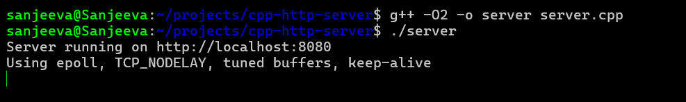

The server starts and prints its configuration: epoll, TCP_NODELAY, tuned buffers, and Keep‑Alive.

### 2. Browser – HTML with CSS Styling

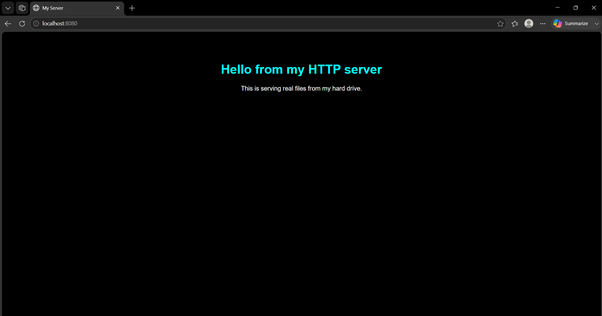

The server serves `index.html`, and the browser correctly applies `style.css` – proving MIME type detection works.

### 3. Browser – Raw CSS

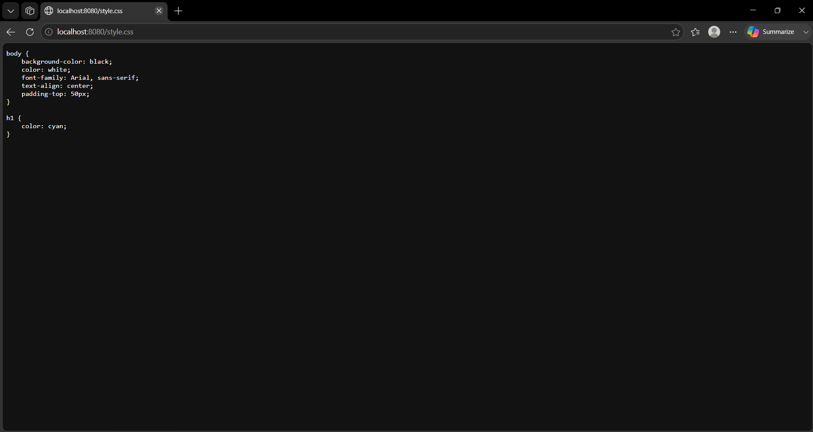

`style.css` is served with the correct `text/css` MIME type.

### 4. HEAD Method (`curl -I`)

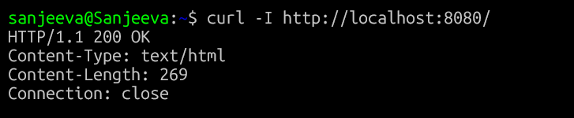

The server correctly returns only headers (no body) for HEAD requests.

### 5. 404 Not Found

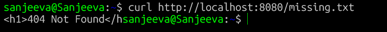

Missing files return a `404 Not Found` status.

### 6. 405 Method Not Allowed

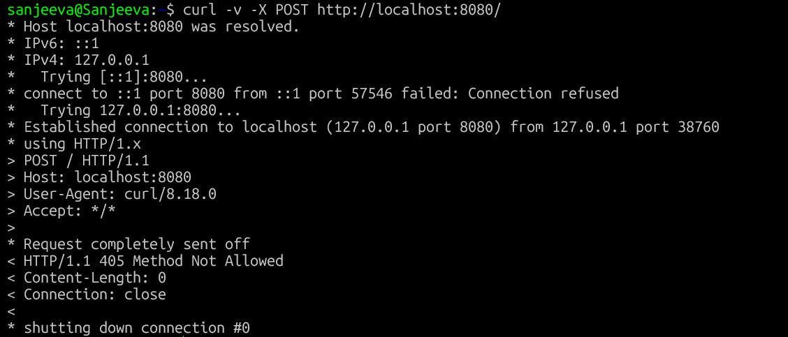

Unsupported methods (e.g., POST) return a `405 Method Not Allowed` status.

### 7. Persistent Keep‑Alive Connections

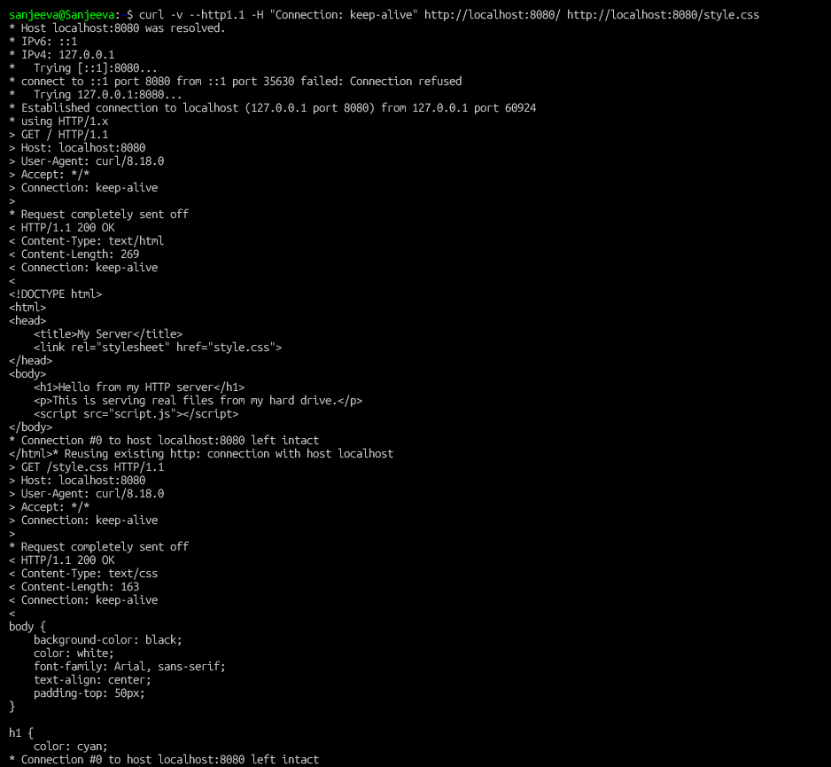

Two requests (`/` and `/style.css`) are sent on the same connection. The output shows `Connection #0 to host localhost:8080 left intact` twice – the connection was reused.

### 8. Request Logging with Timestamps

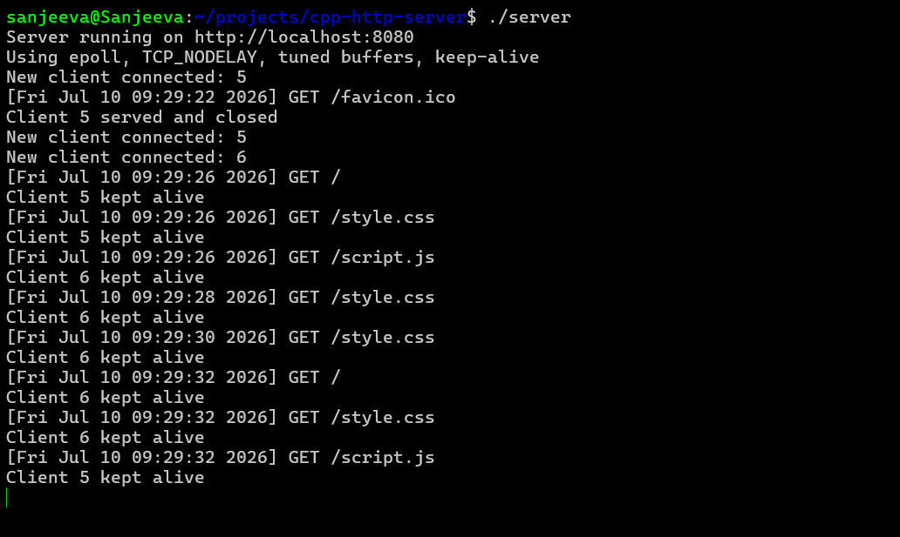

Every request is logged with a timestamp, method, and path. The logs also show `Client X kept alive` when Keep‑Alive is active.

### 9. `wrk` Benchmark – Low Concurrency (2 threads, 10 connections)

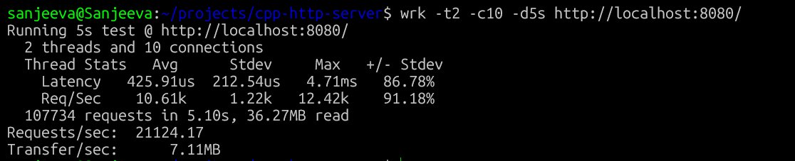

**21,124 requests/sec** with average latency of **425µs**.

### 10. `wrk` Benchmark – High Concurrency (4 threads, 100 connections)

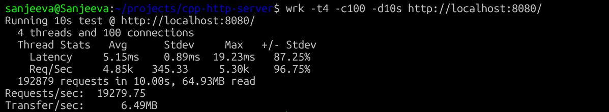

**19,279 requests/sec** with average latency of **5.15ms**.

### 11. Large File Transfer (`sendfile`)

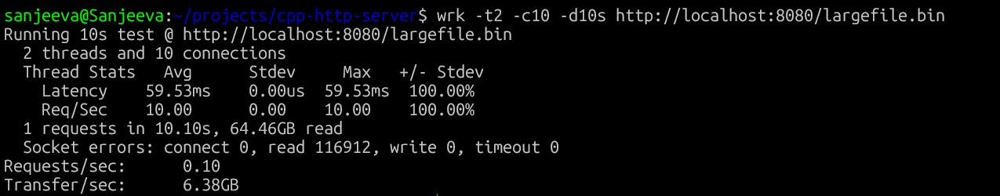

A 50MB file is transferred using `sendfile()`. The kernel handles the entire transfer directly from the disk cache to the socket.

### 12. Stress Test – 10,000 Sequential Requests

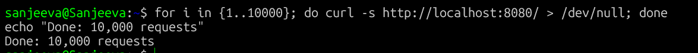

10,000 consecutive `curl` requests completed without any crashes or errors.

---

## Verification (Reproduce the Proofs)

**Prerequisites:** Linux or WSL2, `g++`.

1. **Clone and build**
   ```bash
   git clone https://github.com/pdsnjvrdy/cpp-http-server.git
   cd cpp-http-server
   g++ -O2 -o server server.cpp
   ```

2. **Start the server**
   ```bash
   ./server
   ```

3. **Test GET request**
   ```bash
   curl http://localhost:8080/
   ```
   Should return the HTML page.

4. **Test HEAD request**
   ```bash
   curl -I http://localhost:8080/
   ```
   Should return only headers.

5. **Test 404**
   ```bash
   curl http://localhost:8080/missing.txt
   ```
   Should return `<h1>404 Not Found</h1>`.

6. **Test 405**
   ```bash
   curl -X POST http://localhost:8080/
   ```
   Should return empty response with status 405.

7. **Test Keep‑Alive**
   ```bash
   curl -v --http1.1 -H "Connection: keep-alive" http://localhost:8080/ http://localhost:8080/style.css
   ```
   Should show `Connection #0 left intact` twice.

8. **Run benchmark**
   ```bash
   wrk -t4 -c100 -d10s http://localhost:8080/
   ```
   Should achieve ~19,000+ requests/sec.

9. **Run stress test**
   ```bash
   for i in {1..10000}; do curl -s http://localhost:8080/ > /dev/null; done
   echo "Done: 10,000 requests"
   ```
   Must complete without errors.

Compare your output with the screenshots in `screenshots/`. Exact timings will vary, but all status codes and connection behaviours must match.

---

## Why This Matters

This project demonstrates **low‑level systems programming** at a professional level:

- **Event‑driven architecture** – scaling without threading overhead.
- **Zero‑copy I/O** – kernel‑level optimisation that real servers (Nginx, Apache) use.
- **TCP tuning** – practical understanding of Nagle's algorithm and socket buffers.
- **HTTP protocol implementation** – parsing, methods, headers, status codes, and persistent connections.
- **Observability** – structured logging for debugging and monitoring.
- **Correctness verification** – reproducible benchmarks and stress tests.

Everything is built from scratch – **no external libraries, no frameworks**. Just POSIX APIs and the Linux kernel.
